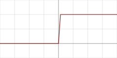
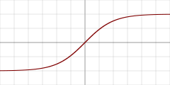
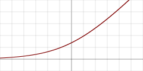
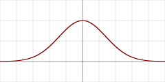

## MicroMLP is a micro artificial neural network multilayer perceptron (principally used on ESP32 and [Pycom](http://www.pycom.io) modules)


#### Very easy to integrate and very light with one file only :
- `"microMLP.py"`

#### MicroMLP features :
- Modifiable multilayer and connections structure
- Integrated bias on neurons
- Plasticity of the connections included
- Activation functions by layer
- Parameters Alpha, Eta and Gain
- Managing set of examples and learning
- QLearning functions to use reinforcement learning
- Save and load all structure to/from json file
- Various activation functions :
  - Heaviside binary step
  - Logistic (sigmoid or soft step)
  - Hyperbolic tangent
  - SoftPlus rectifier
  - ReLU (rectified linear unit)
  - Gaussian function

#### Use deep learning for :
- Signal processing (speech processing, identification, filtering)
- Image processing (compression, recognition, patterns)
- Control (diagnosis, quality control, robotics)
- Optimization (planning, traffic regulation, finance)
- Simulation (black box simulation)
- Classification (DNA analysis)
- Approximation (unknown function, complex function)

<p align="center">
    
</p>

### Using *MicroMLP* static functions :

| Name | Function |
| - | - |
| Create | `mlp = MicroMLP.Create(neuronsByLayers, activationFuncName, layersAutoConnectFunction=None, useBiasValue=1.0)` |
| LoadFromFile | `mlp = MicroMLP.LoadFromFile(filename)` |

### Using *MicroMLP* speedly creation of a neural network :
```python
from microMLP import MicroMLP
mlp = MicroMLP.Create([3, 10, 2], "Sigmoid", MicroMLP.LayersFullConnect)
```

### Using *MicroMLP* main class :

| Name | Function |
| - | - |
| Constructor | `mlp = MicroMLP()` |
| GetLayer | `layer = mlp.GetLayer(layerIndex)` |
| GetLayerIndex | `idx = mlp.GetLayerIndex(layer)` |
| RemoveLayer | `mlp.RemoveLayer(layer)` |
| GetInputLayer | `inputLayer = mlp.GetInputLayer()` |
| GetOutputLayer | `outputLayer = mlp.GetOutputLayer()` |
| Learn | `ok = mlp.Learn(inputVectorNNValues, targetVectorNNValues)` |
| Test | `ok = mlp.Test(inputVectorNNValues, targetVectorNNValues)` |
| Predict | `outputVectorNNValues = mlp.Predict(inputVectorNNValues)` |
| QLearningLearnForChosenAction | `ok = mlp.QLearningLearnForChosenAction(stateVectorNNValues, rewardNNValue, pastStateVectorNNValues, chosenActionIndex, terminalState=True, discountFactorNNValue=None)` |
| QLearningPredictBestActionIndex | `bestActionIndex = mlp.QLearningPredictBestActionIndex(stateVectorNNValues)` |
| SaveToFile | `ok = mlp.SaveToFile(filename)` |
| AddExample | `ok = mlp.AddExample(inputVectorNNValues, targetVectorNNValues)` |
| ClearExamples | `mlp.ClearExamples()` |
| LearnExamples | `learnCount = mlp.LearnExamples(maxSeconds=30, maxCount=None, stopWhenLearned=True, printMAEAverage=True)` |

| Property | Example | Read/Write |
| - | - | - |
| Layers | `mlp.Layers` | get |
| LayersCount | `mlp.LayersCount` | get |
| IsNetworkComplete | `mlp.IsNetworkComplete` | get |
| MSE | `mlp.MSE` | get |
| MAE | `mlp.MAE` | get |
| MSEPercent | `mlp.MSEPercent` | get |
| MAEPercent | `mlp.MAEPercent` | get |
| ExamplesCount | `mlp.ExamplesCount` | get |

### Using *MicroMLP* to learn the XOr problem (with hyperbolic tangent) :
```python
from microMLP import MicroMLP

mlp = MicroMLP.Create( neuronsByLayers           = [2, 2, 1],
                       activationFuncName        = MicroMLP.ACTFUNC_TANH,
                       layersAutoConnectFunction = MicroMLP.LayersFullConnect )

nnFalse  = MicroMLP.NNValue.FromBool(False)
nnTrue   = MicroMLP.NNValue.FromBool(True)

mlp.AddExample( [nnFalse, nnFalse], [nnFalse] )
mlp.AddExample( [nnFalse, nnTrue ], [nnTrue ] )
mlp.AddExample( [nnTrue , nnTrue ], [nnFalse] )
mlp.AddExample( [nnTrue , nnFalse], [nnTrue ] )

learnCount = mlp.LearnExamples()

print( "LEARNED :" )
print( "  - False xor False = %s" % mlp.Predict([nnFalse, nnFalse])[0].AsBool )
print( "  - False xor True  = %s" % mlp.Predict([nnFalse, nnTrue] )[0].AsBool )
print( "  - True  xor True  = %s" % mlp.Predict([nnTrue , nnTrue] )[0].AsBool )
print( "  - True  xor False = %s" % mlp.Predict([nnTrue , nnFalse])[0].AsBool )

if mlp.SaveToFile("mlp.json") :
	print( "MicroMLP structure saved!" )
```

| Variable | Description | Default |
| - | - | - |
| `mlp.Eta` | Weighting of the error correction | 0.30 |
| `mlp.Alpha` | Strength of connections plasticity | 0.75 |
| `mlp.Gain` | Network learning gain | 0.99 |
| `mlp.CorrectLearnedMAE` | Threshold of self-learning error | 0.02 |

| Graphe | Activation function name | Const | Detail |
| - | - | - | - |
|  | `"Heaviside"` | MicroMLP.ACTFUNC_HEAVISIDE | Heaviside binary step |
| ") | `"Sigmoid"` | MicroMLP.ACTFUNC_SIGMOID | Logistic (sigmoid or soft step) |
|  | `"TanH"` | MicroMLP.ACTFUNC_TANH | Hyperbolic tangent |
|  | `"SoftPlus"` | MicroMLP.ACTFUNC_SOFTPLUS | SoftPlus rectifier |
|  | `"ReLU"` | MicroMLP.ACTFUNC_RELU | Rectified linear unit |
|  | `"Gaussian"` | MicroMLP.ACTFUNC_GAUSSIAN | Gaussian function |

| Layers auto-connect function | Detail |
| - | - |
| `MicroMLP.LayersFullConnect` | Network fully connected |

### Using *MicroMLP.Layer* class :

| Name | Function |
| - | - |
| Constructor | `layer = MicroMLP.Layer(parentMicroMLP, activationFuncName=None, neuronsCount=0)` |
| GetLayerIndex | `idx = layer.GetLayerIndex()` |
| GetNeuron | `neuron = layer.GetNeuron(neuronIndex)` |
| GetNeuronIndex | `idx = layer.GetNeuronIndex(neuron)` |
| AddNeuron | `layer.AddNeuron(neuron)` |
| RemoveNeuron | `layer.RemoveNeuron(neuron)` |
| GetMeanSquareError | `mse = layer.GetMeanSquareError()` |
| GetMeanAbsoluteError | `mae = layer.GetMeanAbsoluteError()` |
| GetMeanSquareErrorAsPercent | `mseP = layer.GetMeanSquareErrorAsPercent()` |
| GetMeanAbsoluteErrorAsPercent | `maeP = layer.GetMeanAbsoluteErrorAsPercent()` |
| Remove | `layer.Remove()` |

| Property | Example | Read/Write |
| - | - | - |
| ParentMicroMLP | `layer.ParentMicroMLP` | get |
| ActivationFuncName | `layer.ActivationFuncName` | get |
| Neurons | `layer.Neurons` | get |
| NeuronsCount | `layer.NeuronsCount` | get |

### Using *MicroMLP.InputLayer(Layer)* class :

| Name | Function |
| - | - |
| Constructor | `inputLayer = MicroMLP.InputLayer(parentMicroMLP, neuronsCount=0)` |
| SetInputVectorNNValues | `ok = inputLayer.SetInputVectorNNValues(inputVectorNNValues)` |

### Using *MicroMLP.OutputLayer(Layer)* class :

| Name | Function |
| - | - |
| Constructor | `outputLayer = MicroMLP.OutputLayer(parentMicroMLP, activationFuncName, neuronsCount=0)` |
| GetOutputVectorNNValues | `outputVectorNNValues = outputLayer.GetOutputVectorNNValues()` |
| ComputeTargetLayerError | `ok = outputLayer.ComputeTargetLayerError(targetVectorNNValues)` |

### Using *MicroMLP.Neuron* class :

| Name | Function |
| - | - |
| Constructor | `neuron = MicroMLP.Neuron(parentLayer)` |
| GetNeuronIndex | `idx = neuron.GetNeuronIndex()` |
| GetInputConnections | `connections = neuron.GetInputConnections()` |
| GetOutputConnections | `connections = neuron.GetOutputConnections()` |
| AddInputConnection | `neuron.AddInputConnection(connection)` |
| AddOutputConnection | `neuron.AddOutputConnection(connection)` |
| RemoveInputConnection | `neuron.RemoveInputConnection(connection)` |
| RemoveOutputConnection | `neuron.RemoveOutputConnection(connection)` |
| SetBias | `neuron.SetBias(bias)` |
| GetBias | `neuron.GetBias()` |
| SetOutputNNValue | `neuron.SetOutputNNValue(nnvalue)` |
| ComputeValue | `neuron.ComputeValue()` |
| ComputeError | `neuron.ComputeError(targetNNValue=None)` |
| Remove | `neuron.Remove()` |

| Property | Example | Read/Write |
| - | - | - |
| ParentLayer | `neuron.ParentLayer` | get |
| ComputedOutput | `neuron.ComputedOutput` | get |
| ComputedDeltaError | `neuron.ComputedDeltaError` | get |
| ComputedSignalError | `neuron.ComputedSignalError` | get |

### Using *MicroMLP.Connection* class :

| Name | Function |
| - | - |
| Constructor | `connection = MicroMLP.Connection(neuronSrc, neuronDst, weight=None)` |
| UpdateWeight | `connection.UpdateWeight(eta, alpha)` |
| Remove | `connection.Remove()` |

| Property | Example | Read/Write |
| - | - | - |
| NeuronSrc | `connection.NeuronSrc` | get |
| NeuronDst | `connection.NeuronDst` | get |
| Weight | `connection.Weight` | get |

### Using *MicroMLP.Bias* class :

| Name | Function |
| - | - |
| Constructor | `bias = MicroMLP.Bias(neuronDst, value=1.0, weight=None)` |
| UpdateWeight | `bias.UpdateWeight(eta, alpha)` |
| Remove | `bias.Remove()` |

| Property | Example | Read/Write |
| - | - | - |
| NeuronDst | `bias.NeuronDst` | get |
| Value | `bias.Value` | get |
| Weight | `bias.Weight` | get |

### Using *MicroMLP.NNValue* static functions :

| Name | Function |
| - | - |
| FromPercent | `nnvalue = MicroMLP.NNValue.FromPercent(value)` |
| NewPercent | `nnvalue = MicroMLP.NNValue.NewPercent()` |
| FromByte | `nnvalue = MicroMLP.NNValue.FromByte(value)` |
| NewByte | `nnvalue = MicroMLP.NNValue.NewByte()` |
| FromBool | `nnvalue = MicroMLP.NNValue.FromBool(value)` |
| NewBool | `nnvalue = MicroMLP.NNValue.NewBool()` |
| FromAnalogSignal | `nnvalue = MicroMLP.NNValue.FromAnalogSignal(value)` |
| NewAnalogSignal | `nnvalue = MicroMLP.NNValue.NewAnalogSignal()` |

### Using *MicroMLP.NNValue* class :

| Name | Function |
| - | - |
| Constructor | `nnvalue = MicroMLP.NNValue(minValue, maxValue, value)` |

| Property | Example | Read/Write |
| - | - | - |
| AsFloat | `nnvalue.AsFloat = 639.513` | get / set |
| AsInt | `nnvalue.AsInt = 12345` | get / set |
| AsPercent | `nnvalue.AsPercent = 65` | get / set |
| AsByte | `nnvalue.AsByte = b'\x75'` | get / set |
| AsBool | `nnvalue.AsBool = True` | get / set |
| AsAnalogSignal | `nnvalue.AsAnalogSignal = 0.39472` | get / set |


### By JC`zic for [HC²](https://www.hc2.fr) ;')

*Keep it simple, stupid* :+1:
